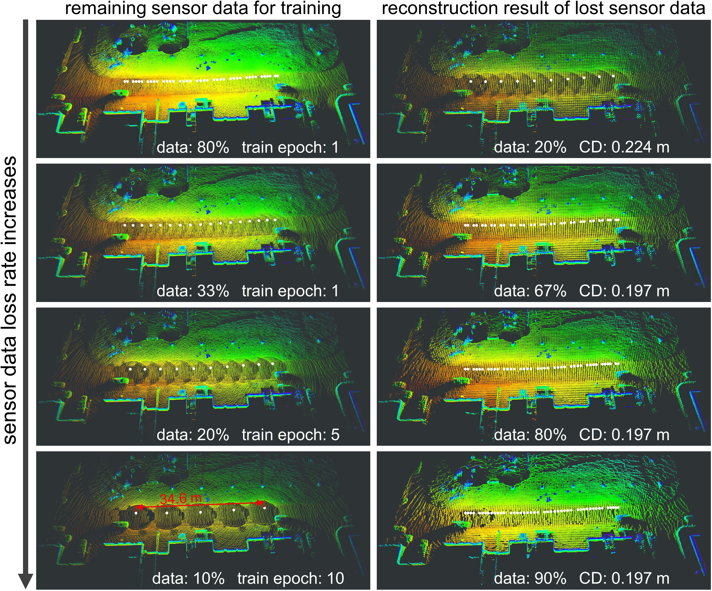

## PC-NeRF: Parent-Child Neural Radiance Fields under Partial Sensor Data Loss in Autonomous Driving Environments

[Xiuzhong Hu](https://github.com/biter0088), Guangming Xiong, Zheng Zang, Peng Jia, Yuxuan Han, [Junyi Ma](https://github.com/BIT-MJY)

<figure>
  <div align=center>
  <div align=left><figcaption>With limited and even one-epoch training, our proposed PC-NeRF reconstructs 3D scenes well using LiDAR point cloud data from the KITTI 00 sequence at different sensor data loss rates. The white dots in each subfigure are the position of each scan, and the LiDAR operates at 10 Hz. The sensor data loss rate of 20% in the first row is a commonly used dataset division ratio, upon which we raise the challenge of 3D reconstruction by increasing the loss rate. Surprisingly, the 3D reconstruction accuracy of our proposed method increases when the sensor data loss rate increases from 20% to 67% because our devised model can rapidly learn an approximate scene distribution at the segment level. Moreover, if the input sensor data is too much or too little during training, more training epochs are needed to fit the model.</figcaption>
</figure>


**Reference method**[arxiv](https://arxiv.org/abs/2310.00874)
```bash
@misc{hu2023pcnerf,
      title={PC-NeRF: Parent-Child Neural Radiance Fields under Partial Sensor Data Loss in Autonomous Driving Environments}, 
      author={Xiuzhong Hu and Guangming Xiong and Zheng Zang and Peng Jia and Yuxuan Han and Junyi Ma},
      year={2023},
      eprint={2310.00874},
      archivePrefix={arXiv},
      primaryClass={cs.CV}
}
```

**The code is coming soon ...**
